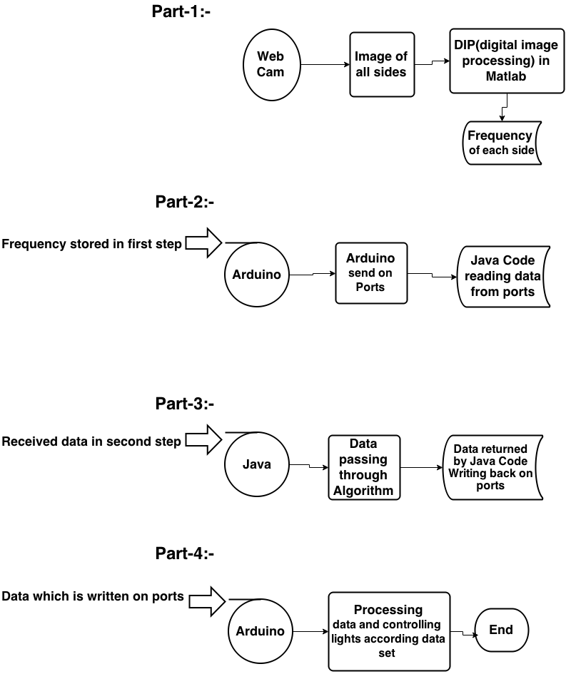
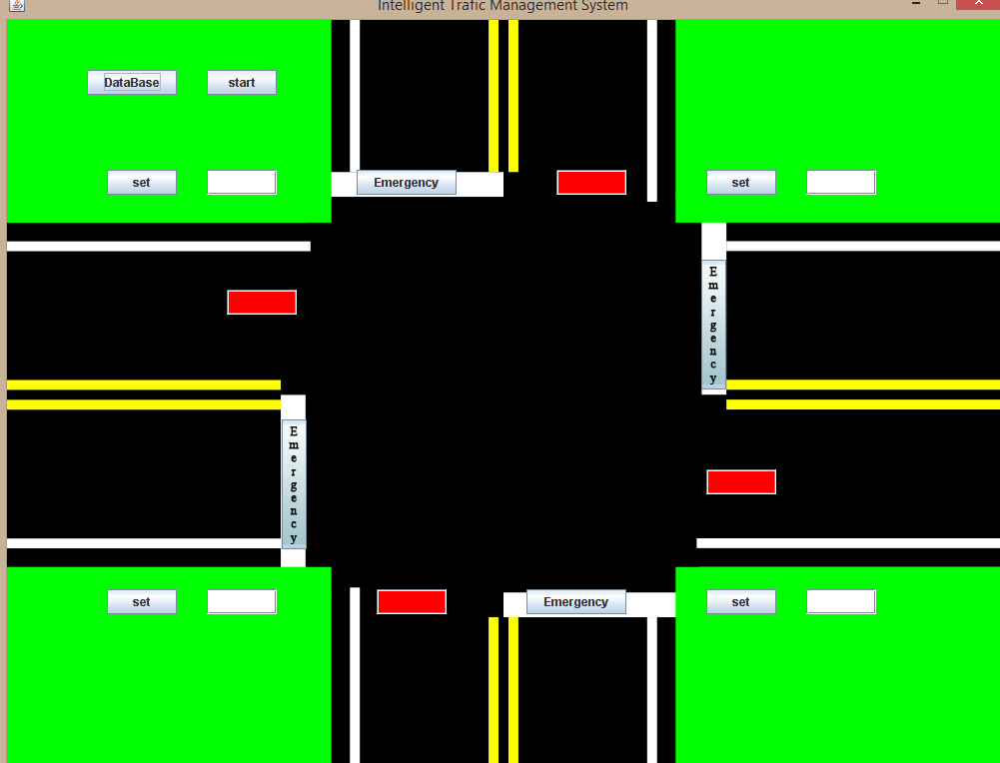

# ITMS

# What is ITMS ?
  
ITMS is intelligent traffic management system.it tells you about how efficently you can manage traffic without putting extra efforts.

# How it works ?

It contains four parts...!!

Part-1:
        In first part we have webcam and we click some photos of every side at crossroads and now we start extracting frquency of vehicle using image processing from photos.

Part-2:
        In this step we have frequency of every side.we send it to arduino and arduino will write all data on ports.
    
Part-3:
        Using serial communication of java and arduino.Java code will receive all data which is available on ports and it will give you time for each side meaning is that it will give you red or green time for each side.All data which Java code will return.Write back on ports.
        
Part-4:
        In this part arduino will get data from ports using serial communication.Data is nothing but arrays of green and red time.After this arduino code will handle green and red lights according to array values of green and red.        

## ITMS flow chart view :-
 
 
 

## ITMS UI view :-

 
 

## Contributor :-
#####              Arpit Koolwal (Software part)
#####              Aman Sharma   (Software part)
#####              Anil kumar    (Hardware part)
#####              Ashish Gupta  (Hardware part)    

 
